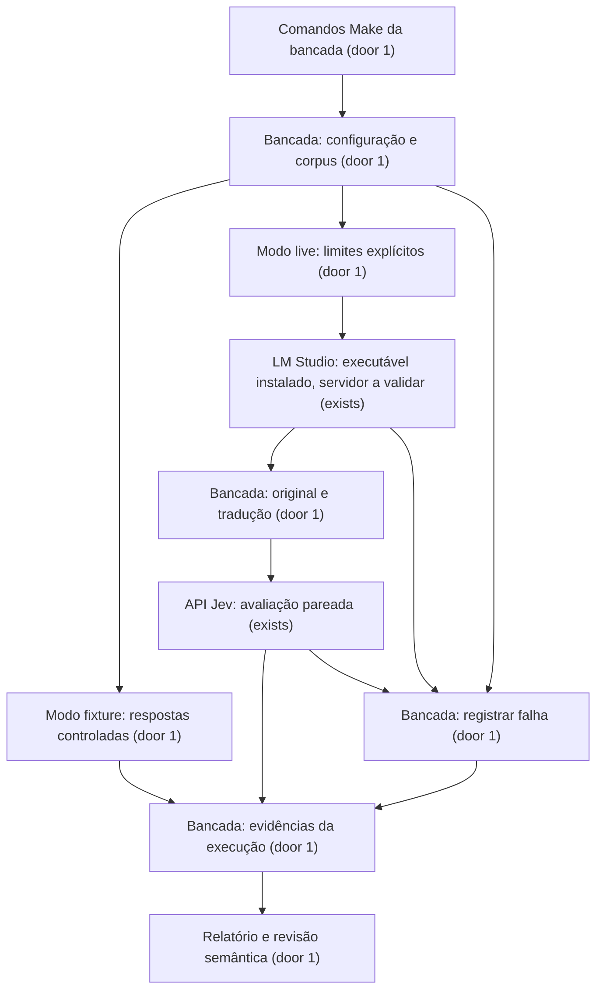

# Viabilidade da tradução local e das avaliações do Jev

Status: plano e gabaritos do [corpus](corpus.md) aprovados pelo usuário em 22/09/2026; [checks](checks.md) derivados. O escopo autorizado permanece somente planejamento: estas aprovações não autorizam implementação ou ensaios. Nenhum ensaio real executado.

**Decisão de 02/10/2026 (usuário): a tradução local saiu do estudo.** Um experimento com o Jev real (`jev-latest`, resolvido para `jev-1.13.0` em todas as chamadas) enviou os 12 casos relacionais da revisão 1 em PT-BR e em inglês, com as mesmas rubricas e o mesmo corpo de requisição da bancada. O inglês foi traduzido à mão pelo agente, sem o TranslateGemma, o que dá o melhor caso possível para a tradução. Resultado: escolhas iguais nos dois idiomas em 68 de 72 julgamentos; acertos contra o gabarito PT 63/72 e EN 66/72. As quatro divergências e a vantagem do inglês estão em escolhas de baixa confiança (0,11–0,50), concentradas em R08, o caso de informação insuficiente, que o Jev erra nos dois idiomas. Sem R08, PT 63/66 e EN 64/66. Traduzir localmente antes do Jev não compensa o custo do runtime, do template oficial e da contagem de tokens. Evidência: script e respostas brutas em [`evidence/2026-10-02-jev-pt-en/`](evidence/2026-10-02-jev-pt-en/).

Consequências: C50, C51 e C59 foram removidos de [checks](checks.md); a emenda de 01/10/2026 à AC 27 foi revogada; os *Independent tests* reais de S2 e S3 passam a ser cumpridos, no que resta, pelo experimento acima. A bancada mantém o modo live e suas salvaguardas (`template_unverified`, `token_count_unavailable`), provadas com transportes controlados, mas **o modo live não foi validado contra serviços reais** e não deve ser apresentado como tal. Limitação do experimento: as rubricas em inglês (`JEV_RUBRIC`, escritas pelo agente) foram usadas nos dois idiomas sem revisão humana. Achados do experimento para o produto: o Jev quase nunca escolhe `insufficient`, e trata como dependentes duas perguntas sobre a mesma restrição (R11).

## Problem

O agrupamento adaptativo do PROBE depende de reconhecer relações entre perguntas sem alterar o significado das respostas. Hoje não há evidência neste repositório de que o Jev reconhece nossos casos, de que traduzir para inglês melhora essas avaliações ou de que o TranslateGemma Q6_K preserva as restrições no equipamento disponível. Fixar a tradução e os limiares de confiança agora converteria hipóteses em regras sem uma comparação observável.

O usuário informou uma RTX 5070 Ti de 16 GB e escolheu TranslateGemma 12B Q6_K como candidato. Não forneceu metas numéricas de latência, acurácia ou economia. O executável `lms` está disponível no WSL, mas servidor ativo, modelo carregado e template funcional não foram confirmados. A leitura atual de GPU via NVML foi bloqueada pelo ambiente; isso não comprova ausência de GPU.

Esta entrega fornece uma bancada local e um relatório comparativo reproduzível para decidir se mantemos o candidato e quando traduzir antes de avaliar com Jev. Não constrói o chat nem o algoritmo final de blocos. A primeira entrega de viabilidade foi delimitada a estas duas integrações; CLIs e conectividade terão planos próprios.

## Flow

Reutiliza o LM Studio instalado e as APIs documentadas do Jev, tomando as relações entre perguntas do desenho aprovado.

No modo live, o texto português de cada caso é traduzido antes de avaliar os dois idiomas. Os braços usam as mesmas instruções, critérios e versão do Jev. Os julgamentos independentes de um caso são enviados juntos. O gabarito não é enviado aos modelos. Alternar a ordem dos braços por caso evita avaliar sempre o português primeiro.

Uma falha encerra a coleta, preserva o prefixo concluído e enumera os itens não executados. Um braço português já concluído sem seu par inglês fica visível, mas fora da comparação pareada. Não há troca automática de modelo, provedor ou idioma.

Alocação no fluxo: preparação e fixture recebem AC 1–10; tradução, AC 11–17; Jev, AC 18–24; evidências e falhas, AC 25–31; relatório, AC 32–37. As provas de AC 3 e AC 10 que exigem coleta live ou relatório ficam com S3 e S5 (C52–C54 em [checks](checks.md)), conforme decisão do usuário em 30/09/2026; os critérios não mudam.

## Impact

| Front | What changes |
| --- | --- |
| domain | Processo, etapa, bloco e decisão mantêm os significados aprovados. A bancada não cria decisões do usuário. |
| domain | Execução de estudo é uma coleta identificada para um corpus e configurações específicos; não é uma sessão de chat. Não existem chamadores atuais desse termo. |
| domain | Braço é a avaliação de um caso em português original ou inglês traduzido; não altera o domínio do produto. |
| stored data | Sem banco existente, migrations ou backfill. Somente arquivos locais de evidência. |
| environment | Node e PNPM no WSL, servidor LM Studio configurado e Jev. Não instalar outro runtime, baixar modelo ou alterar Cloak nesta entrega. |
| tooling | Acrescentar futuramente comandos Make do estudo ao Makefile documental; o plano já é validável por `make plan-validate`. |
| existing files | Preservar as skills locais preexistentes; atualizar no desenho apenas o registro de sua aprovação. |

## Relations

Uma execução referencia uma revisão do corpus e uma configuração. Uma revisão contém casos identificados e expectativas de referência. Cada execução contém resultados dos itens previstos, inclusive os não executados, e zero ou mais traduções e avaliações.

Uma avaliação pertence a um caso, braço e execução. Uma tradução identifica o texto original e sua execução. Uma revisão semântica referencia a saída concreta revisada. O relatório deriva das evidências dessa execução.

Uma execução existente não é sobrescrita; nova coleta recebe outro identificador. Essas evidências não são tabelas do produto nem o relatório de uma decisão PROBE.

## Surface

None - nothing consumed outside: não há endpoint novo do produto ou do executor WSL. Os comandos locais e artefatos experimentais são descritos nos critérios. A bancada consome serviços configurados sem expor um serviço próprio na rede.

## Landing

| One-way door | Literal shape | Alternative rejected |
| --- | --- | --- |
| 1. Padrão de bancada reproduzível separado do produto | `make ai-study-dry-run`, `make ai-study-run MODE=fixture`, `make ai-study-run MODE=live`, `make ai-study-report RUN_ID=...`; arquivos em `artifacts/ai-study/<run-id>/` com `schema_version: 1`, fora do Git; apoio gerenciado por PNPM. | Ensaios avulsos sem corpus ou configuração identificados, que impedem comparação dos mesmos casos e distinção entre simulação e evidência real. |

O formato interno completo dos arquivos e a organização do código são reversíveis. Este padrão experimental não estabelece contratos do tradutor de produção, executor ou banco. Recomendações que alterem o desenho aprovado exigem decisão explícita posterior.

## Criteria

### S1: Ensaio delimitado sem serviços reais (P1)

O usuário inspeciona o que será executado e verifica a coleta sem consumir modelos.

**Acceptance Criteria**

1. WHEN `make ai-study-dry-run` receber configuração válida THEN a bancada SHALL imprimir manifesto com modo, hash do corpus, modelos solicitados, máximos de chamadas e destinos sem credenciais.
2. WHEN dry-run ou modo `fixture` executar THEN a bancada SHALL fazer zero acessos de rede ou invocações de modelos reais.
3. The bancada SHALL fazer zero invocações de Codex, Claude, Grok, `agy` ou Cloak nesta entrega.
4. The bancada SHALL aceitar somente `fixture` e `live` como modos, com `fixture` por padrão.
5. IF a configuração for inválida antes da coleta THEN a bancada SHALL encerrar com código `2` e diagnóstico que nomeie a configuração inválida sem revelar seu valor secreto.
6. The corpus SHALL conter exatamente os casos relacionais `R01`–`R12` e os casos inglês→português `T01`–`T06` enumerados abaixo.
7. The corpus SHALL associar a cada caso relacional seis expectativas entre `yes`, `no` e `insufficient`, justificadas textualmente para revisão humana.
8. The bancada SHALL exigir o mesmo hash de corpus e gabarito nas avaliações comparadas de uma execução.
9. WHEN a coleta `MODE=fixture` terminar THEN a bancada SHALL produzir artefatos marcados como `fixture` e encerrar com código `0`.
10. The bancada SHALL rejeitar mistura de respostas simuladas e reais numa execução com código `2`.

| Caso | Situação a concretizar no corpus | Distinção |
| --- | --- | --- |
| R01 | Orçamento informado e pergunta sobre ser mensal ou de implantação. | Complemento e dependência de interpretação. |
| R02 | Prazo para decidir e prazo para entregar explicitamente distintos. | Mesmo tema sem contradição. |
| R03 | Prazo de duas semanas e integração obrigatória disponível em um mês. | Conflito entre respostas. |
| R04 | Preferência por automação com solução manual temporária permitida. | Preferência versus proibição. |
| R05 | Proibição de enviar dados ao fornecedor e opção que exige esse envio. | Negação e inviabilidade. |
| R06 | Despesa única de implantação e limite mensal de operação. | Unidade e periodicidade. |
| R07 | Janela de indisponibilidade e cor de indicador sem requisito que as relacione. | Independência no mesmo contexto. |
| R08 | Referência a “esse prazo” sem antecedente identificável. | Insuficiência versus relação negativa. |
| R09 | Capacidade requerida esclarece a opção; opção estabelece capacidade possível. | Dependência mútua. |
| R10 | Alteração de orçamento torna uma opção antes aceita inviável. | Impacto entre etapas. |
| R11 | Duas perguntas pedem a mesma restrição com redação distinta. | Redundância e agrupamento. |
| R12 | Plano B da etapa E depende da reversibilidade da opção da etapa O. | Dependência entre etapas sem fundir blocos. |

Os seis julgamentos são: B depende de A; A depende de B; as perguntas se complementam; a mudança indicada em A exige reavaliar B; é útil responder ambas no mesmo bloco; as respostas atuais estão em conflito. Cada caso fornece contexto e mudança proposta quando aplicável; ausência da informação necessária admite `insufficient`. Rubricas referem explicitamente A e B e distinguem relação de mera semelhança de assunto.

`T01`–`T06` são textos originalmente em inglês, cobrindo negação, obrigação versus preferência, moeda/periodicidade, condição de prazo, identificador técnico e ambiguidade. Não são retraduções de saídas anteriores: ida e volta não comprova fidelidade.

Textos completos e gabaritos serão escritos na fase de checks, antes dos adaptadores e gerações, para revisão do usuário. Aprovar o plano aprova a cobertura, não presume revisão de textos ainda inexistentes.

**Independent test:** dry-run e fixture com transporte que falha se tentar rede; inspecionar manifesto, os 18 IDs e sua proveniência simulada.

### S2: Traduções reais rastreáveis (P1)

O usuário inspeciona o candidato no equipamento local, preservando os originais.

**Acceptance Criteria**

11. WHEN preparar uma tradução live THEN a bancada SHALL registrar original, direção de idioma, modelo solicitado e revisão do template.
12. IF não for possível confirmar o uso do template oficial do modelo THEN a bancada SHALL encerrar a coleta como `incomplete` com razão `template_unverified`.
13. IF a entrada formatada ultrapassar 2048 tokens no candidato THEN a bancada SHALL rejeitar o envio com razão `input_limit`, sem truncar.
14. IF não houver contagem pelo tokenizer correspondente THEN a bancada SHALL impedir o envio com razão `token_count_unavailable`.
15. WHEN receber uma tradução THEN a bancada SHALL preservar sua saída literal como texto derivado vinculado ao original, sem substituí-lo.
16. IF a tradução estiver vazia ou terminar por limite de saída THEN a bancada SHALL marcá-la `invalid_translation`, impedindo sua avaliação no braço inglês.
17. The bancada SHALL registrar duração por chamada em milissegundos e informações de modelo, tokens e memória fornecidas pelo runtime, identificando dados indisponíveis com justificativa.

Candidato: `mradermacher/translategemma-12b-it-GGUF`, Q6_K. A identidade efetivamente carregada é registrada; tamanho de download não é medição de VRAM. Não há declaração de compatibilidade baseada apenas no tamanho do arquivo.

O caminho inicial usa LM Studio existente. Seu endpoint de completions não aplica template: caso usado, renderizar explicitamente o template oficial. Não presumir que chat genérico ou campos específicos do Transformers sejam equivalentes. A forma de contar tokens será escolhida entre runtime e tokenizer correspondente, mantendo AC 13–14. Se a compatibilidade não for demonstrada, registrar o bloqueio; não trocar o candidato silenciosamente.

Revisar fidelidade por significado, entidades, valores, negações, condições e ambiguidades, sem exigir igualdade com uma única redação inglesa. O tradutor não deve preencher lacunas de informação.

**Independent test:** coletar os seis casos T no servidor identificado; verificar tratamento de saídas vazias e truncadas com transporte controlado. Simulação não comprova execução real. Emenda de 02/10/2026: a coleta real dos casos T saiu do estudo com a tradução local (Decisão de 02/10/2026); fica a parte com transporte controlado.

### S3: Comparação pareada no Jev (P1)

O usuário vê o efeito de traduzir o mesmo caso antes da avaliação.

**Acceptance Criteria**

18. WHEN avaliar um caso relacional THEN a bancada SHALL enviar os seis julgamentos como perguntas `Choice` independentes com critérios `yes`, `no` e `insufficient` na mesma chamada Jev.
19. The bancada SHALL excluir gabaritos, justificativas de referência e revisões humanas do estado enviado aos modelos.
20. WHEN formar um par de avaliações THEN a bancada SHALL manter idênticos instruções, critérios e modelo Jev resolvido nos dois braços, variando apenas original e tradução.
21. IF a resposta Jev não contiver seis resultados com escolhas, probabilidades e confianças válidas THEN a bancada SHALL registrá-la como `invalid_response`, fora das comparações completas.
22. WHEN concluir uma avaliação Jev THEN a bancada SHALL registrar escolha, distribuição, confiança, modelo retornado, uso informado e duração por caso e braço.
23. The bancada SHALL comparar cada escolha válida com a expectativa correspondente, distinguindo acerto, erro e ausência de comparação.
24. IF faltar um braço válido ou houver divergência de configuração no par THEN a bancada SHALL excluir o caso do denominador pareado e identificá-lo como incompleto.

As instruções dos dois braços são iguais, em inglês: a variável comparada é a língua do texto avaliado. IDs e etapas permanecem fora do texto traduzido. Cada caso é um texto identificado contendo A, B e contexto; não é necessário fazer a LLM gerar JSON para recuperar os campos.

Em AC 21, válido significa: seis IDs esperados, tipo `choice`, escolha pertencente ao conjunto definido, probabilidades finitas entre 0 e 1 para os três critérios com soma a no máximo 0,000001 de distância de 1, e confiança finita entre 0 e 1. Rejeitar resultados faltantes, não converter texto livre em escolha por adivinhação.

O modelo solicitado é configuração explícita; se a versão resolvida mudar entre os braços, não contar o par como válido. Distribuições e confiança são evidências descritivas; não são limiares de produção nem probabilidade de uma decisão de negócio estar certa.

**Independent test:** observar seis resultados por braço num caso conhecido e excluir pares inválidos com respostas controladas; separar a prova de integração da concordância do modelo com o gabarito. Emenda de 02/10/2026: a observação real ficou com o experimento da Decisão de 02/10/2026 (seis resultados por braço nos 12 casos, mesma versão do Jev nos dois braços, concordância contada à parte), feito fora da bancada; a exclusão de pares inválidos segue provada com respostas controladas.

### S4: Coleta limitada com preservação na falha (P1)

O usuário sabe quanto pode ser chamado e conserva as evidências se a coleta parar.

**Acceptance Criteria**

25. The bancada SHALL admitir uma coleta por diretório de evidências, usando exclusão mútua local para rejeitar coleta simultânea nesse diretório.
26. IF um identificador de execução já existir THEN a bancada SHALL recusar sobrescrevê-lo com código `2`.
27. The bancada SHALL limitar cada execução a 20 chamadas locais e 24 chamadas Jev, incluindo tentativas com falha e sem retries automáticos.
28. IF uma chamada ultrapassar seu timeout THEN a bancada SHALL encerrar a espera e a coleta como `incomplete`, com itens restantes não executados.
29. WHEN ocorrer falha de transporte, erro HTTP ou resposta inválida THEN a bancada SHALL preservar evidências concluídas e encerrar com código `1`.
30. The bancada SHALL gravar manifesto e cada resultado por substituição atômica de arquivo, impedindo que JSON parcial seja aceito como evidência válida.
31. The bancada SHALL excluir chaves, tokens e cabeçalhos de autenticação de logs, manifestos e relatórios.

Limites iniciais: uma chamada em andamento, timeout local de 120 segundos e Jev de 30 segundos, saída local até 2048 tokens. As 20 chamadas locais acomodam 18 traduções e até duas verificações de template. A contagem inclui retries de SDK, se existirem; a implementação deve desativá-los, não contar só as chamadas do código chamador.

Emenda de 01/10/2026 à AC 27: além das 20 chamadas locais, a execução admite até 18 contagens de tokens (uma por tradução), num orçamento próprio, registrado em `manifest.calls` como serviço separado (`local_token_count`). Elas são contadas antes do envio, falhas inclusive, seguem a regra de uma chamada em andamento e o timeout local e não têm retry (reconexão e retry do `@lmstudio/sdk` desativados). Justificativa: a contagem não executa inferência; escondê-la nas 20 chamadas ou abrir mão dela violaria AC 13–14. A contagem ainda não está implementada e segue bloqueando a coleta live. Revogada em 02/10/2026 com a tradução local (Decisão de 02/10/2026): a contagem não será implementada e C59 foi removido; a AC 27 volta ao texto original.

Término por sinal (01/10/2026): o primeiro SIGINT ou SIGTERM encerra a espera e a coleta como `incomplete` com motivo `interrupted` (código 1, resultado remoto desconhecido, sem alegar cancelamento) e libera a exclusão mútua; um segundo sinal segue o comportamento padrão. A trava de uma coleta encerrada sem liberá-la não é tomada automaticamente: a coleta seguinte sai com código 2 e indica a remoção manual. O relatório (S5) trata `interrupted` como coleta incompleta.

Interromper a espera não comprova cancelamento da inferência remota; registrar resultado desconhecido quando aplicável. Uma nova tentativa cria nova execução explícita, sem retomar ou reaproveitar resultados silenciosamente.

Somente exemplos sintéticos: não ler outros chats, perfis ou diretórios de credenciais. Artefatos não entram no Git; corpus e código podem ser versionados. Não há limpeza automática de evidências. A conclusão de coleta se distingue de sua qualidade semântica.

**Independent test:** falha fixture após dois resultados, timeout e coletas concorrentes; verificar arquivos íntegros, ausência de sobrescrita e contagem sem serviço pago.

### S5: Relatório para uma decisão informada (P1)

O relatório distingue funcionamento técnico, fidelidade e efeito nas avaliações.

**Acceptance Criteria**

32. WHEN `make ai-study-report RUN_ID=...` receber evidências válidas THEN a bancada SHALL gerar Markdown apenas desses arquivos, sem modelos ou rede.
33. The relatório SHALL ordenar seções de configuração/proveniência, completude, originais/traduções, revisão semântica, comparação Jev e limitações.
34. The relatório SHALL apresentar por braço e julgamento as contagens de acertos, erros e itens sem avaliação, além dos resultados pareados completos.
35. The relatório SHALL identificar cada tradução como `pending`, `faithful` ou `meaning_changed`, com revisor e justificativa nos dois últimos estados.
36. IF houver coleta faltante ou revisão semântica pendente THEN o relatório SHALL marcar a conclusão como `inconclusive`.
37. The relatório SHALL separar o estado técnico da recomendação humana `keep_candidate`, `reject_candidate` ou `expand_study`, sem promover configurações de produto automaticamente.

O gabarito é revisado antes de gerar saídas; a revisão da tradução considera a saída concreta. Discordância do modelo não autoriza alterar o gabarito para melhorar métricas. Correção fundamentada cria nova revisão e comparação identificada. Doze casos não estabelecem acurácia geral nem calibração de confiança.

Uso ausente não significa custo zero. Só converter tokens em dinheiro com tarifa identificada; não inventar economia. Não há meta mínima de ganho fabricada: decidir por regressões semânticas, exemplos, diferença observada e latência medida. Resultados de fixture são sempre apresentados como simulados.

**Independent test:** gerar relatório fixture com par completo, par incompleto e tradução alterada; verificar as pendências e a identificação de simulação sem chamar modelos.

## Out of scope

| Excluded | Why |
| --- | --- |
| Chat, sidebar, wizard e página de configuração | Entrega de produto posterior; não são necessários para a comparação. |
| Banco, migrations e decisões persistidas | O estudo produz arquivos experimentais, não o schema do produto. |
| Executor WSL, Cloak e quatro CLIs | Integração independente com plano próprio. |
| Conectividade Docker–WSL, Vite e empacotamento | Entrega de ambiente; a bancada roda no WSL. |
| Algoritmo final de blocos e limites de confiança | Dependem da evidência que será produzida. |
| Download, instalação ou troca automática de modelo | Ausência do candidato é diagnosticada, não resolvida silenciosamente. |
| Imagens, dados pessoais e idiomas além de PT/EN | A hipótese atual diz respeito ao texto do PROBE. |
| PDF do estudo técnico | Markdown atende ao ensaio; PDF permanece obrigatório para relatórios de decisão do MVP. |
| Comparação automática de quantizações e runtime de produção | Q6_K é o primeiro candidato; ampliar exige os resultados do ensaio. |
| Tradução local antes do Jev em coleta real | Decisão de 02/10/2026: o Jev responde igual em PT-BR e em inglês em 68 de 72 julgamentos; o ganho não paga o runtime local. |

## Assumptions

| Assumption | Chosen default | Rationale | Confirmed? |
| --- | --- | --- | --- |
| Delimitação da primeira entrega | Tradução e Jev neste plano; CLIs e conectividade em outro. | Testar a hipótese central sem acoplar ensaios independentes. | y — plano aprovado em 22/09/2026 |
| Runtime inicial | LM Studio existente, URL e modelo configurados explicitamente. | Já há executável instalado; isso não fixa o runtime do produto. | y — plano aprovado em 22/09/2026 |
| Ambiente da bancada | WSL, Node 24 disponível e PNPM, sem alterar versões globais. | Aproveita o ambiente inspecionado e a stack prevista. | y — plano aprovado em 22/09/2026 |
| Revisão semântica | Arquivo de revisão preenchido pelo usuário e associado à execução. | Dispensa interface de produto e avaliação por modelo de fronteira. | y — plano aprovado em 22/09/2026 |

**Open questions:** none — as escolhas de desenho desta entrega têm defaults explícitos acima. Isso não confirma disponibilidade operacional: os pré-requisitos abaixo continuam pendentes para a coleta real.

| # | Kind | Pré-requisito operacional | Até sua confirmação |
| --- | --- | --- | --- |
| 1 | blocks go-live | Q6_K num servidor LM Studio acessível pelo WSL, com identidade confirmada. | Implementar fixture; não declarar tradução real validada. |
| 2 | blocks go-live | Chave Jev e modelo de avaliação disponíveis para a coleta. | Verificar integração simulada; não declarar avaliação real validada. |
| 3 | blocks go-live | Corpus e gabaritos revisados antes da primeira geração. | Prepará-los em checks; manter ensaio real pendente da revisão. |

Em 02/10/2026, com a tradução local fora do estudo, o pré-requisito 1 deixou de bloquear esta entrega. O 2 foi atendido no experimento da Decisão de 02/10/2026, e o 3 já estava atendido pelo corpus aprovado.

## Observable

| Surface | Decision | Landing |
| --- | --- | --- |
| Comandos Make | Modos, parâmetros e configuração inválida | AC 1, 4, 5 e assinatura local abaixo. |
| Comandos Make | Saída e verbosidade | AC 1, 9, 29, 32; manifesto legível, estado e caminho de artefatos, sem despejar credenciais. |
| Comandos Make | Códigos de saída | AC 5, 9, 26, 29; 0 concluído, 1 incompleto, 2 uso/configuração inválida. Qualidade não é inferida do código 0. Emenda de 01/10/2026: o código é o da CLI Node; via `make`, ele aparece na linha `make: *** [...] Error N`, e o próprio make sai com 2 quando o recipe falha (encerrado por um sinal recebido por todo o grupo, como Ctrl+C, ele termina pelo próprio sinal, sem `Error N`). Para automação, a fonte autoritativa do término é `status`/`failure` do manifesto. Não há entrypoint alternativo. |
| Comandos Make | Falha parcial | AC 28–30; preservar resultados e enumerar os não executados. |
| Documento | Estrutura, idioma e próxima ação | AC 33–37; prosa em português, originais preservados, revisão e recomendação humana. |
| Corpus | Agrupamento, nomes e ordem | AC 6–8; casos R e T em ordem numérica e IDs únicos. |
| Corpus | Duplicatas e exceções | AC 5, 8; ID repetido ou expectativa fora do domínio é configuração inválida; caso novo exige revisão identificada. |
| Tela | Estados e ações destrutivas | n/a - não existe tela ou ação destrutiva nesta entrega. |
| API recebida | Resposta, erro, autorização, versão e rate limit | n/a - não existe endpoint novo recebendo chamadas. |
| Harness | Perfil e verificação | existing - tlc-spec-lean instalada, perfil light até decisão explícita diferente. |

Assinatura futura: `MODE=fixture` por padrão; `RUN_ID` gerado na coleta se omitido e obrigatório no relatório; `CORPUS` usa o corpus versionado padrão; `LOCAL_BASE_URL` e `LOCAL_MODEL` obrigatórios em live; `LOCAL_API_TOKEN` opcional conforme servidor; `TYPESAFE_API_KEY` e `JEV_MODEL` obrigatórios em live; `LOCAL_TIMEOUT_SECONDS=120`, `JEV_TIMEOUT_SECONDS=30`, `LOCAL_MAX_OUTPUT_TOKENS=2048`. Não há flags de seleção parcial, retry ou paralelismo nesta versão. Os limites de chamadas são AC 27.

`RUN_ID` explícito aceita letras ASCII, números, hífen e sublinhado, de 1 a 64 caracteres, nunca um caminho arbitrário. Timeouts são inteiros positivos e limite de saída inteiro de 1 a 2048. Destinos são endpoint oficial Jev e URL configurada do servidor local, sem varredura de rede. Segredos são fornecidos pelo ambiente, não por argumentos CLI.

As nove dimensões consideradas para a derivação são: validação/limites (AC 5–8, 13–14, 21, 27); falha parcial (AC 16, 24, 28–30); repetição/duplicatas (AC 26–27); autorização/rate limits (AC 2–4, 27, 31, parada sem retry); concorrência/ordem (AC 25 e pares identificados); ciclo de vida (AC 26, 30 e ausência de limpeza automática); dependências externas (AC 12–17, 21, 28–29); transições (AC 9–10, 24, 36); observabilidade (AC 1, 17, 22, 33–37). A tabela formal Swept com as provas previstas está em [checks.md](checks.md).

## Sources

- [Desenho aprovado](../../../docs/superpowers/specs/2026-09-22-probe-mvp-design.md), seções 4, 7, 8, 11 e 13, e aprovação explícita do usuário nesta conversa.
- Contratos técnicos: [API Jev](https://docs.typesafe.ai/api), [TranslateGemma oficial](https://huggingface.co/google/translategemma-12b-it) e [LM Studio — completions sem template automático](https://lmstudio.ai/docs/developer/openai-compat/completions).
- [tlc-spec-lean — formato e gate](../../../.claude/skills/tlc-spec-lean/references/plan.md). A escolha explícita desse harness prevalece sobre a decomposição genérica por tarefas da skill writing-plans.
