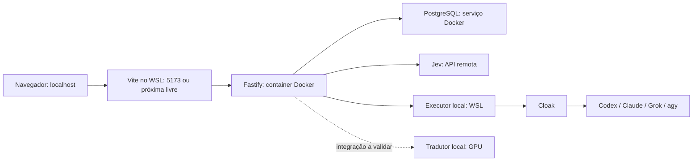

# PROBE — desenho consolidado do MVP

Data: 22 de setembro de 2026.

Status: desenho aprovado pelo usuário em 22 de setembro de 2026. A aprovação permite avançar ao planejamento das entregas; não constitui aprovação de um plano de implementação nem autoriza iniciar código da aplicação, instalações, chamadas pagas ou deploy.

## 1. Objetivo e autoridade

Transformar o framework PROBE em uma aplicação de apoio à tomada de decisão, com experiência de chat e um wizard adaptativo. O processo começa pela descrição de um problema e termina com uma decisão confirmada pelo usuário, acompanhada de um plano de execução e de um relatório persistido.

O usuário decide. A aplicação controla o cumprimento do framework. Jev avalia questões estruturadas; LLMs de fronteira ajudam a esclarecer, formular e comparar; um modelo local traduz quando necessário.

As instruções e decisões da conversa são a referência de escopo. O PDF `Aula; RFC Rápido - Tomando Decisões em Startups.pdf` é a referência do método. Seus exemplos ilustram o framework e não se tornam requisitos de integrações ou comandos da aplicação.

Neste documento:

- **Decisões consolidadas** representam escolhas explícitas feitas durante a conversa.
- **Propostas de comportamento** tornam o desenho concreto para revisão; ainda não são obrigações congeladas com provas.
- **Validações técnicas** indicam experimentos necessários antes de assumir desempenho ou compatibilidade.

## 2. Escopo consolidado

| Área | Decisão |
| --- | --- |
| Método | Percorrer Problema, Restrições, Opções, Balanceamento e Execução, sob controle da aplicação. |
| Conversa | Chat com perguntas adaptativas, navegação entre perguntas relacionadas e revisão de respostas. |
| Orientação | Indicador discreto da etapa e resumo consultável do entendimento atual. |
| Histórico | Persistir chats, perguntas, respostas, avaliações e alterações em PostgreSQL. |
| Banco | Um único banco com tabelas relacionadas. |
| Retomada | Reabrir processos não finalizados a partir do progresso salvo. |
| Finalização | Confirmação explícita do usuário; processo finalizado imutável. |
| Execução | Registrar primeiro passo concreto, critério de sucesso e plano B; acompanhamento da realização fora do MVP. |
| Branches | Revisar uma decisão concluída ou iniciar outro problema com contexto herdado, preservando a origem. |
| Relatórios | Consulta na aplicação e exportação em Markdown e PDF já no MVP. |
| Jev | API para avaliações, filtro e roteamento; apoio à identificação de relações entre perguntas. |
| LLMs de fronteira | Exclusivamente CLIs: Codex, Claude Code, Grok e Gemini via `agy`, mediadas pelo Cloak. |
| Falha de CLI | Preservar progresso; oferecer nova tentativa ou seleção manual de outra CLI; sem troca automática. |
| Tradução | Direção proposta: tradução local para apoiar avaliações em inglês; validar fidelidade e desempenho. |
| Frontend | Vite + shadcn/ui, gerenciamento por PNPM. React com TypeScript é a proposta para compor essa stack. |
| Backend | Fastify, com arquitetura de monólito modular. |
| Desenvolvimento | Vite no WSL, fora do Docker; Fastify e PostgreSQL em serviços Docker Compose; executor no WSL. |
| Endereço | Frontend começa em 5173, procura a próxima porta disponível e abre em `localhost`. |
| Operação | Toda operação CLI do projeto deve ter uma entrada correspondente no Makefile. |
| Autenticação | Sem login de usuários no MVP. |
| Harness | `tlc-spec-lean` para planejamento, provas, construção e verificação das entregas posteriores. |

## 3. Jornada e obrigações do framework

### 3.1 Início

Em um processo novo, a primeira interação é a descrição do problema. A aplicação preserva o texto original e solicita à LLM de fronteira ajuda para melhorar a definição, remover ambiguidades e identificar informações faltantes. O usuário confirma ou corrige a formulação antes de ela ser tratada como o problema estabelecido.

Sugestões e inferências de IA permanecem identificadas como tal até serem confirmadas pelo usuário. Nenhuma sugestão se torna silenciosamente uma resposta, fato ou restrição dele.

### 3.2 Etapas

| Etapa | Conteúdo do framework | Proposta de condição para confirmar a etapa |
| --- | --- | --- |
| P — Problema | Problema real versus sintoma; consequência de não resolver; motivo da urgência. | Enunciado confirmado e respostas registradas para esses pontos; ambiguidades que alteram o enunciado resolvidas. |
| R — Restrições | Prazo; sistemas e APIs envolvidos; condições inegociáveis. | Restrições e preferências distinguidas, com escopo e unidades esclarecidos quando aplicáveis. Ausência de prazo ou de integração pode ser registrada explicitamente. |
| O — Opções | Possibilidade de eliminar o problema; solução mais simples, inclusive manual; alternativa 80/20; reversibilidade. | Alternativas concretas registradas, com análise dessas perspectivas ou justificativa de sua inaplicabilidade, sem inventar opções apenas para atingir uma quantidade. |
| B — Balanceamento | Ganhos e perdas; capacidade de escala; manutenção. | Alternativas comparadas, escolha do usuário registrada e motivos dos descartes documentados, sem conflito pendente que comprometa a escolha. |
| E — Execução | Primeiro passo concreto; como reconhecer sucesso; plano B. | Os três elementos registrados e compatíveis com a opção escolhida. |

Essas condições são propostas para derivação posterior de critérios observáveis. Uma etapa não fica completa apenas porque houve uma mensagem ou porque um modelo retornou alta confiança.

Informação desconhecida é registrada explicitamente. Se afetar uma conclusão, essa conclusão permanece pendente; questões independentes podem continuar. A aplicação não inventa evidência nem exige falsa certeza para preencher campos.

A escolha feita em B continua revisável enquanto o processo estiver aberto. Após E, uma revisão final apresenta problema, restrições, escolha, concessões e plano. A confirmação explícita do usuário encerra o processo.

## 4. Perguntas, blocos e dependências

### 4.1 Experiência de resposta

Uma pergunta pode ficar em foco, mas não existe uma sequência irreversível de perguntas isoladas. Perguntas relacionadas são apresentadas em blocos de contexto, com navegação e preservação dos rascunhos. O usuário pode consultar respostas anteriores e outras perguntas já disponíveis no bloco.

Cada pergunta informa seu assunto, sua relação com o contexto e, quando necessário, por que está sendo feita. Alternativas únicas, múltiplas e resposta livre podem ser usadas conforme a questão; o estilo de componentes Questionnaire é a referência de interação.

Respostas interdependentes podem permanecer provisórias até que o conjunto seja esclarecido. Uma síntese do bloco permite confirmar ou corrigir o entendimento. Informações já fornecidas são reaproveitadas, evitando repetição desnecessária.

### 4.2 Agrupamento apoiado pelo Jev

Proposta de desenho: combinar dependências explícitas do framework com avaliações semânticas do Jev. Avaliar dimensões separadas permite registrar relações simultâneas e direcionais:

| Relação | Pergunta de avaliação |
| --- | --- |
| Dependência | A resposta de A é necessária para interpretar ou responder B? |
| Complemento | B esclarece ou delimita A? |
| Impacto | Uma alteração em A pode invalidar uma conclusão associada a B? |
| Agrupamento | Apresentar A e B no mesmo bloco ajuda a responder com coerência? |

O estado enviado inclui enunciados, objetivos, etapas e respostas relevantes, com suas versões. A aplicação compõe as avaliações em um mapa de relações e usa esse mapa para organizar blocos e identificar reavaliações.

As relações são estimadas antes das respostas e revistas quando surgem novas informações. Relações entre etapas são permitidas; uma conexão entre dois blocos não exige fundi-los. Semelhança de assunto, dependência e contradição são avaliações distintas. Contradições são avaliadas considerando as respostas e o contexto.

Blocos em andamento permanecem estáveis para navegação. Relações novas aparecem como complementos ou pendências visíveis, sem rearranjo silencioso das perguntas já apresentadas. Perguntas mutuamente dependentes podem ser respondidas provisoriamente e confirmadas em conjunto, evitando bloqueio circular.

Na incerteza, a LLM pode ajudar a interpretar o caso ou formular um esclarecimento ao usuário. Não estabelecer uma relação com segurança não equivale a provar que ela não existe. Limites de confiança e estratégias de seleção das perguntas a comparar exigem validação técnica.

### 4.3 Revisões e conflitos

Cada alteração de resposta cria uma nova versão e preserva a anterior. Avaliações referenciam as versões que efetivamente analisaram. Resultados dependentes ficam pendentes de reavaliação; respostas que não foram afetadas são reaproveitadas.

Pendências podem afetar perguntas anteriores, posteriores e outras etapas. O chat indica o que precisa ser revisto e por quê. Uma pendência bloqueia as conclusões dependentes, não toda a coleta de informações. Nenhum processo é finalizado com pendência que comprometa sua conclusão.

Exemplo: prazo de duas semanas e dependência obrigatória de uma integração disponível apenas em um mês. A aplicação apresenta o conflito e pergunta se existe alternativa provisória, se o prazo deve ser revisto ou se a dependência foi entendida incorretamente. A resolução fica vinculada às respostas envolvidas.

## 5. Opções e balanceamento

Proposta para o MVP: matriz qualitativa de atendimento às restrições, ganhos, perdas, esforço, escala, manutenção e reversibilidade. Pontuação numérica ponderada não é requisito inicial.

Uma restrição inegociável não pode ser compensada por uma boa avaliação em outra dimensão. A mudança da restrição exige uma revisão explícita pelo usuário, com histórico e reavaliação dos resultados afetados.

O Jev pode avaliar dimensões específicas; a LLM pode explorar alternativas, esclarecer concessões e recomendar uma opção. A escolha pertence ao usuário. Uma recomendação não é uma resposta selecionada automaticamente.

Confiança do modelo e qualidade da alternativa são conceitos separados: o modelo pode estar seguro ao escolher a melhor de várias opções inadequadas. A viabilidade e a suficiência do conjunto de opções precisam ser avaliadas.

Se nenhuma alternativa atender às restrições, a aplicação explica os impedimentos e conduz à exploração de opções ou à revisão explícita de restrições. O processo permanece aberto se faltarem informações; não há escolha forçada nem finalização automática.

## 6. Finalização, branches e relatórios

### 6.1 Imutabilidade

A finalização é uma transição confirmada pelo usuário sobre o estado atual do processo. O backend deve garantir que a confirmação se refere às versões apresentadas e que o conjunto confirmado e o relatório sejam preservados de forma consistente.

Processos concluídos são somente leitura. Retomar um processo aberto restaura mensagens, versões válidas, rascunhos salvos, etapa, bloco e pendências. Uma execução de IA interrompida é identificada como interrompida; retomar o chat não significa reenviar automaticamente a solicitação ao provedor.

### 6.2 Dois tipos de branch

| Tipo | Comportamento |
| --- | --- |
| Revisar uma decisão | Criar processo aberto ligado à origem, herdando contexto e respostas; registrar o que mudou e reavaliar os resultados afetados antes de uma nova confirmação. |
| Novo problema relacionado | Herdar contexto selecionado da origem, estabelecer o novo problema na primeira interação e percorrer o PROBE completo. |

A origem permanece intacta. O contexto herdado é uma cópia identificada do estado utilizado, não uma dependência de conteúdo mutável. Proposta: distinguir fatos herdados das conclusões específicas do problema anterior, para que estas não sejam presumidas válidas para o novo problema.

### 6.3 Relatório

O relatório contém:

- Identificação do processo, data de finalização e origem da branch, quando houver.
- Problema original e formulação confirmada.
- Registro por etapa das perguntas, opções apresentadas e respostas selecionadas ou livres.
- Restrições, preferências, suposições declaradas e esclarecimentos relevantes.
- Comparação das alternativas, opção escolhida e sua justificativa.
- Alternativas descartadas e motivos dos descartes.
- Primeiro passo, critério de sucesso e plano B.
- Histórico das revisões e resoluções relevantes, distinguindo o conteúdo superado do válido na conclusão.

A proposta de apresentação é um resumo da decisão seguido do registro por etapa e de um histórico identificável. A preservação das perguntas e respostas não depende de um resumo da LLM.

Consulta na aplicação, Markdown e PDF derivam do mesmo conteúdo estruturado e congelado. A exportação não faz nova chamada à IA. Caso se use uma LLM para redigir a síntese, ela é revisada antes da finalização e passa a integrar o conteúdo congelado.

O PDF deve ter texto selecionável, títulos, tabelas legíveis e paginação. A exportação de processos ainda abertos não faz parte do escopo consolidado; o resumo em tela atende ao acompanhamento durante a conversa.

## 7. Responsabilidade de cada recurso de IA

| Recurso | Papel | Limite |
| --- | --- | --- |
| Aplicação | Controlar etapas, versões, transições, persistência e confirmação. | Não delegar a um prompt o cumprimento integral do PROBE. |
| Jev | Avaliar questões delimitadas, relações, suficiência e caminhos de atendimento. | Retorna valores estruturados; não gera texto de conversa nem substitui a confirmação humana. |
| LLM de fronteira | Refinar o problema, formular perguntas e alternativas, esclarecer ambiguidades e ajudar na análise. | Acesso por CLI via Cloak; inferências identificadas até confirmação. |
| Tradutor local | Traduzir os trechos necessários entre português e inglês. | Não completar informações, resolver ambiguidades ou escolher alternativas. |

Na primeira definição do problema, a LLM participa conforme o requisito original. Em interações posteriores, a aplicação pode apresentar perguntas ou textos predefinidos a partir de avaliações estruturadas do Jev, sem chamar uma LLM apenas para redigir uma resposta conhecida.

Choice, Score e Noul servem a julgamentos distintos. Choice e Score incluem `confidence`; Noul devolve uma probabilidade sem esse campo separado. Perguntas independentes sobre o mesmo estado podem ser agrupadas numa chamada; uma avaliação que dependa de resultados ainda não disponíveis requer uma etapa posterior.

Os critérios, rubricas e limites usados para roteamento precisam ser explícitos e versionados. Alta confiança não dispensa regras de integridade nem torna uma sugestão aceita pelo usuário. Registrar modelo efetivamente usado, versões de entrada e resultados permite entender avaliações antigas.

## 8. Tradução local

O português original permanece a fonte de verdade. A tradução é uma representação derivada, vinculada à versão do texto, idioma, modelo e configuração utilizados. Alterações no original invalidam a tradução correspondente e as avaliações dependentes.

Caminhos propostos:

1. Avaliação pelo Jev: conteúdo original → tradução local dos trechos necessários → avaliação em inglês → resultados estruturados identificados → apresentação em português.
2. Apoio de fronteira: conteúdo original e avaliações relevantes → CLI → resposta solicitada em português.
3. Texto gerado em inglês: tradução local para apresentação, quando realmente necessária.

Resultados estruturados do Jev são associados aos identificadores das perguntas e opções originais. Não há tradução de volta de números, identificadores ou rótulos que a aplicação já conhece em português.

Reaproveitar traduções por versão evita retraduzir o histórico inteiro. Dividir textos deve preservar os trechos necessários à interpretação de pronomes, condições e termos técnicos. Valores, datas, unidades, negações e identificadores precisam manter significado e associação.

Candidato inicial escolhido para avaliação: `mradermacher/translategemma-12b-it-GGUF`, variante `Q6_K`, num equipamento com RTX 5070 Ti de 16 GB. A captura fornecida mostrou download de 10,52 GB. Isso não comprova consumo de VRAM, compatibilidade, latência ou fidelidade. Trata-se de uma conversão comunitária GGUF do TranslateGemma baseado no Gemma 3; não é o Gemma 4 QAT inicialmente mencionado.

A ficha oficial do TranslateGemma consultada informa entrada de 2 mil tokens e um template específico de tradução. O adaptador deverá respeitar o formato e o limite do modelo efetivamente utilizado, sem presumir que ampliar o contexto no runtime valida entradas maiores.

O runtime e sua localização exata, Windows ou WSL, ainda não foram escolhidos. A aplicação deve ter configuração própria para o tradutor local; seu acesso não representa uma integração com API remota de LLM de fronteira. A escolha entre servidor local e chamada de processo será resolvida na validação técnica.

## 9. Arquitetura e ambiente

O domínio permanece em um monólito modular Fastify, com responsabilidades separadas para PROBE, conversas, integrações de IA, configurações e relatórios. O executor é um adaptador do ambiente local para acesso às CLIs; não decide regras do produto.

### 9.1 Desenvolvimento e empacotamento

Vite roda diretamente no WSL. Sua porta inicial é 5173, com busca automática pela próxima livre. O endereço aberto e apresentado ao usuário utiliza `localhost`. A comunicação com o backend deve continuar funcionando quando a porta do Vite mudar.

Fastify e PostgreSQL rodam em serviços separados no Docker Compose. Portas publicadas do backend, banco e executor precisam ser configuráveis para coexistir com as outras aplicações locais. O requisito de busca automática de porta foi definido para o Vite; não se presume o mesmo comportamento para todos os serviços.

Para a aplicação empacotada, a proposta é servir o frontend compilado pelo Fastify no container da aplicação, mantendo PostgreSQL em serviço separado e volume persistente. A execução via CLI continua dependendo do executor no host; o pacote não é autossuficiente sem essa integração.

### 9.2 Executor e Cloak

O backend envia uma solicitação identificada com provedor, modelo, perfil opcional e conteúdo. O executor invoca `cloak exec` no diretório definido, encaminha a saída e informa conclusão, falha, timeout ou cancelamento. Formato de transporte, portas, limites e eventos exatos pertencem ao planejamento da integração.

O Cloak resolve perfis pelo diretório e permite perfil explícito. A configuração do aplicativo deve oferecer o perfil do diretório ou um perfil selecionado. As contas e credenciais das CLIs continuam administradas no host pelo Cloak.

O executor aceita operações de geração predefinidas, com argumentos controlados e sem interpolar conteúdo do usuário num comando de shell. Proposta: usar uma credencial técnica na comunicação backend–executor e restringir ferramentas das CLIs ao necessário para gerar conteúdo. Isso é independente de login de usuários na aplicação.

As ajudas locais confirmaram modos não interativos nos quatro executáveis. Não foram realizados testes de geração, acesso a modelos, streaming, cancelamento, consumo ou autenticação por esse caminho. O uso das CLIs já configuradas foi informado pelo usuário.

### 9.3 Configuração da aplicação

Página para selecionar CLI, modelo, perfil Cloak ou perfil do diretório e testar a conexão mediante ação do usuário. Incluir configuração do Jev, do executor e do tradutor local conforme os adaptadores definidos. Nenhum teste pago deve ocorrer apenas por abrir a página.

Configurações não sensíveis ficam no PostgreSQL. Tokens técnicos e credenciais devem ser tratados no backend ou ambiente de execução; não integrar relatórios nem ser enviados desnecessariamente ao navegador. A estratégia de armazenamento de segredos pertence ao planejamento.

Proposta: trocar configurações vale para novas solicitações. Solicitações anteriores mantêm o registro do provedor, modelo e perfil utilizados.

### 9.4 Make e PNPM

Todos os comandos operacionais documentados deverão ter entrada Make, incluindo bootstrap com `pnpm create vite@latest`, dependências, desenvolvimento, migrations, testes, validações do harness, build e operação Docker. PNPM será o gerenciador de bibliotecas.

Entradas previstas, ainda não implementadas:

| Comando | Intenção |
| --- | --- |
| `make help` | Listar operações e parâmetros disponíveis. |
| `make up` | Subir os serviços Docker do ambiente, incluindo backend e banco. |
| `make down` | Parar os serviços preservando dados persistidos. |
| `make frontend` | Iniciar Vite no WSL e abrir o endereço localhost na porta encontrada. |
| `make executor` | Iniciar o executor das CLIs no WSL. |
| `make dev` | Coordenar os serviços Docker, frontend e executor. |

O ciclo de vida do runtime de tradução será integrado após sua escolha. Estes nomes não afirmam que exista um Makefile neste estágio documental.

## 10. Persistência e recuperação

O modelo conceitual inclui processos de decisão, mensagens, perguntas e blocos, versões de respostas, relações entre perguntas, avaliações, solicitações e tentativas de IA, traduções, configurações e relatórios finais. A organização exata em tabelas e suas migrations será definida nos planos.

As associações essenciais são:

- Um processo contém mensagens, perguntas, respostas e avaliações e pode ter múltiplos descendentes por branch.
- Cada branch identifica um processo de origem e o contexto copiado.
- Uma resposta mantém suas versões; avaliações e traduções referenciam as versões usadas.
- Relações identificam origem, destino, tipo e avaliação que as estabeleceu; conhecimento explícito do framework também tem origem identificável.
- Uma solicitação de IA pode ter múltiplas tentativas; cada tentativa registra seu estado e provedor.
- A finalização identifica o conjunto confirmado e seu relatório, preservando a leitura histórica.

Proposta de integridade: salvar uma resposta confirmada e atualizar seu progresso de forma consistente; rejeitar alterações baseadas em uma versão superada em vez de sobrescrevê-la silenciosamente. Uma resposta de IA que chegue depois de o contexto mudar não pode confirmar o estado novo automaticamente.

Persistir mensagens concluídas e estados de solicitações é obrigatório. Salvar cada fragmento de streaming não é requisito decidido; uma resposta parcial nunca é confundida com uma resposta concluída. O planejamento deve especificar a recuperação após interrupção sem criar duplicidade de conteúdo aceito.

### Falhas

| Falha | Comportamento |
| --- | --- |
| CLI indisponível, limite, autenticação ou timeout | Preservar progresso; oferecer nova tentativa ou outra CLI escolhida pelo usuário. |
| Executor interrompido | Identificar solicitações interrompidas e permitir retomada manual, sem apagar resultados persistidos. |
| Jev indisponível | Proposta: preservar progresso, permitir nova tentativa e manter pendentes as conclusões dependentes; não substituir automaticamente por fronteira. |
| Tradutor indisponível ou saída inválida | Proposta: preservar original e progresso; permitir nova tentativa, sem tratar tradução incompleta como válida. |
| Falha no banco ao salvar | Não indicar sucesso; manter a informação recuperável na interface enquanto a sessão permitir e oferecer nova tentativa. |
| Falha na exportação | Preservar decisão e relatório congelados; permitir gerar o arquivo novamente sem nova chamada à IA. |

Uma tentativa repetida deve ser associada à solicitação original e não duplicar respostas aceitas. Não se promete execução remota exatamente uma vez quando o resultado do provedor for desconhecido; registrar a interrupção permite distinguir essa situação.

## 11. Validações técnicas antes das obrigações finais

Os experimentos abaixo ainda não foram executados. Eles não são uma autorização de implementação nesta etapa.

| Questão | Evidência necessária | Consequência |
| --- | --- | --- |
| Jev melhora o agrupamento? | Exemplos com dependência direcional, complementos, independência, ciclos e relações entre etapas; comparar a avaliação com relações rotuladas por humanos. | Definir rubricas, limites e encaminhamento de incerteza. |
| Traduzir melhora a decisão do Jev? | Comparar português direto e tradução inglesa sobre os mesmos casos, incluindo falsos positivos e relações perdidas. | Confirmar quando a tradução deve participar do fluxo. |
| Q6_K é adequado ao equipamento? | Medir VRAM, latência e fidelidade PT↔EN com negações, prazos, unidades, ambiguidades e termos do PROBE; comparar Q5_K_M se necessário. | Fixar modelo, runtime, limites de entrada e configuração. |
| O template funciona no runtime escolhido? | Traduções reais respeitando idiomas e formato oficial, inclusive limites e segmentação de trechos relacionados. | Definir o contrato do adaptador de tradução. |
| As quatro CLIs funcionam pelo executor? | Exercitar invocação via Cloak, perfil, captura de saída, erro, timeout e cancelamento em cada CLI. | Definir capacidades por provedor sem presumir formatos idênticos. |
| Docker alcança os serviços locais? | Verificar acesso ao executor WSL e ao runtime local escolhido, inclusive após reinício. | Fixar endereçamento e ciclo de vida dos serviços. |
| Porta do Vite ocupada | Verificar abertura em localhost na próxima porta livre e comunicação com a API. | Formalizar prova do requisito de desenvolvimento. |

Na ausência dessas evidências, não declarar economia financeira medida, precisão assegurada, desempenho em tokens por segundo ou consumo total de memória. Dados de consumo são registrados quando o provedor os fornece; ausência de dado não significa custo zero.

## 12. Fora do MVP

- Login de usuários, equipes, permissões por usuário e colaboração simultânea como funcionalidade de produto.
- Execução automática das ações decididas e acompanhamento de seu cumprimento.
- APIs remotas diretas para LLMs de fronteira.
- Troca automática de CLI em caso de falha ou limite.
- Edição de processos finalizados.
- Escolha ou finalização automática baseada em confiança do modelo.
- Integrações com os sistemas do exemplo do PDF, como Kiwify e GitHub.
- Busca automática de evidências externas, upload de documentos e tradução de imagens como funcionalidades de produto.
- Matriz numérica ponderada, comparação visual entre branches e notificações de revisão como requisitos desta versão.

Essas exclusões mantêm o escopo da primeira versão. Novas necessidades podem ser discutidas posteriormente sem alterar o histórico das decisões já concluídas na aplicação.

## 13. Caminho para planejamento com tlc-spec-lean

Este desenho de produto é referência preparatória. A skill `tlc-spec-lean` é aplicada aos planos de funcionalidades, e não como obrigação de transformar esta consolidação inteira em um plano único com dezenas de tarefas.

Sequência proposta de entregas, ainda sem decomposição executável:

1. **Viabilidade das integrações:** obter as evidências de Jev, tradução, CLIs e conectividade que afetam o desenho.
2. **Processo persistido e retomável:** estabelecer o fluxo PROBE, histórico e revisão, com uma jornada vertical navegável.
3. **Assistência adaptativa:** integrar as CLIs e avaliações do Jev, tradução e formação de blocos, com recuperação de falhas.
4. **Conclusão e derivação:** completar finalização imutável, branches e relatórios na aplicação, Markdown e PDF.

Cada entrega precisa preservar o objetivo observável do usuário. Um plano pode reunir mais de uma dessas áreas quando isso reduzir dependências artificiais; a ordem não é uma lista de tarefas congelada.

Para cada funcionalidade, o harness produzirá `.specs/features/<feature>/plan.md`, depois `checks.md` com obrigações e provas, construção e verificação independente. Critérios EARS, relações, superfícies e decisões difíceis de reverter devem ser concretizados no plano pertinente. Os validadores da skill serão usados nas fases correspondentes e terão comandos Make.

Nenhum perfil de verificação foi explicitamente escolhido pelo usuário; o padrão da skill é `light`. A recomendação para o trabalho posterior é discutir `standard`, sobretudo para integridade de histórico, dependências e finalização, sem alterar silenciosamente o perfil. O verificador independente será usado na fase de implementação, conforme o harness.

O próximo artefato após a revisão desta consolidação será o plano da primeira entrega delimitada. Ainda não existem `checks.md`, código da aplicação, executor implementado ou configuração Docker/Make produzidos por este trabalho.

## 14. Referências e evidências consultadas

- Conversa de definição do MVP, em 22/09/2026: fonte das decisões e revisões de escopo.
- PDF local `C:/Users/junior/Desktop/diretórios/tlc/Aula; RFC Rápido - Tomando Decisões em Startups.pdf`: perguntas e etapas do PROBE, lido durante o brainstorming.
- [Jev — introdução](https://docs.typesafe.ai/introduction), [API](https://docs.typesafe.ai/api), [estado](https://docs.typesafe.ai/concepts/state), [primitivas](https://docs.typesafe.ai/primitives), [estrutura](https://docs.typesafe.ai/primitives/advanced), [confiança](https://docs.typesafe.ai/confidence), [SDK JavaScript](https://docs.typesafe.ai/sdk/javascript) e [agent skill](https://docs.typesafe.ai/agent-skill).
- [shadcn — instalação](https://ui.shadcn.com/docs/installation) e [Questionnaire](https://ui.shadcn.com/docs/components/base/questionnaire).
- [Vite — opções do servidor](https://vite.dev/config/server-options) e [Fastify](https://fastify.dev/).
- [TranslateGemma — ficha oficial](https://huggingface.co/google/translategemma-12b-it) e [conversão GGUF selecionada](https://huggingface.co/mradermacher/translategemma-12b-it-GGUF).
- Ajuda local de `cloak`, `cloak exec`, `cloak use`, `codex`, `claude`, `grok` e `agy`: leitura de capacidades, sem executar gerações.
- [tlc-spec-lean instalada no repositório](../../../.claude/skills/tlc-spec-lean/SKILL.md).

Links externos registram as fontes consultadas no brainstorming. Modelos e APIs devem ser verificados novamente quando os contratos de implementação forem escritos.
